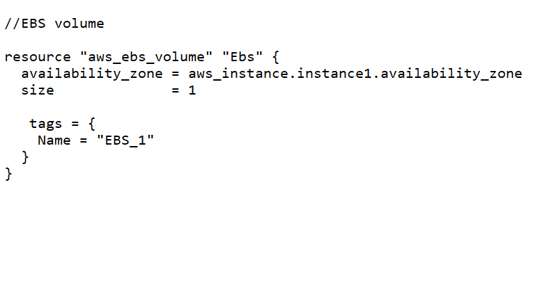
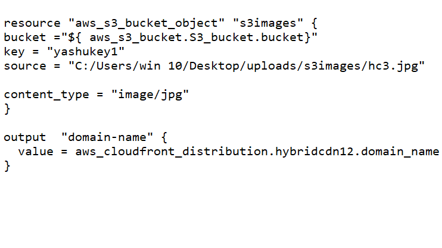

# aws_cloud

This the first task of hybrid multi cloud.
Here we built an aws infrastructure using terraform code.
The task includes:

1. Create the key and security group which allow the port 80.
2. Launch EC2 instance.
3. In this Ec2 instance use the key and security group which we have created in step 1.
4. Launch one Volume (EBS) and mount that volume into /var/www/html
5. Developer have uploded the code into github repo also the repo has some images.
6. Copy the github repo code into /var/www/html
7. Create S3 bucket, and copy/deploy the images from github repo into the s3 bucket and change the permission to public readable.
8 Create a Cloudfront using s3 bucket(which contains images) and use the Cloudfront URL to  update in code in /var/www/html

# solution

//yashu

# step:1 

Firstly We will configure the aws profile.

# Step:2
Then we will set our provider which is aws and the region.

# Step:3
we used existing security group and used an key pair.

# Step:4
Then we launch our ec2 instance using our key-pair and security group created earlier.

#step:5
Creating an EBS volume and will attach this volume to our instance, then we will mount this EBS volume in the /var/www/html location of our instance.

 

# Step:6
Created an Github repo named cloud and uploaded an simple html code into it.
 

# Step:7
Then we will copy the html code into var/www/html folder.

# Step:8
Creating a S3 bucket 

# Step:9
Uploading images into it and allowing public access.

# Step:10
Then we will create a CloudFront{CDN} using the S3 bucket. We wil update  the html code with cloudfront. 

# launching our infrastructure 

At last we will use the terraform code in a file named task.tf
// Using terraform init commands to install plugins.
// Using terraform apply --auto-approve to launch the whole infratructure.

Using the IP of our instance we will host our html code.

