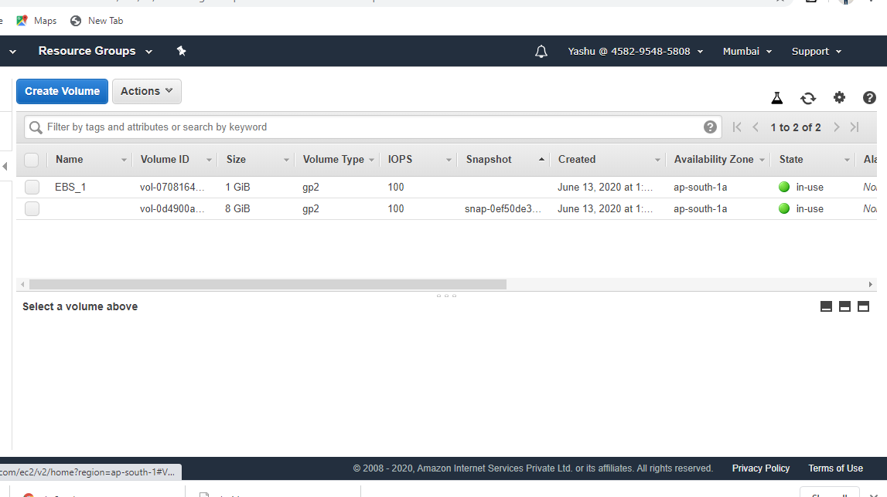

# Cloud
 The cloud gives us easy access to a broad range of
 technologies so that you can innovate faster and
 build nearly anything that we can imagine. We can 
 quickly spin up resources as you need them–from
 infrastructure services, such as compute, storage,
 and databases, to Internet of Things, machine learning,
 data lakes and analytics, and much more.

# AWS
 AWS (Amazon Web Services) is a comprehensive, evolving
 cloud computing platform provided by Amazon that includes
 a mixture of infrastructure as a service (IaaS), platform
 as a service (PaaS) and packaged software as a service
 (SaaS) offerings.

# Main Services used
Service #1 - EC2 [Elastic Compute Cloud]

Service #2 - S3 Bucket

Service #3 - CloudFront

Service #4 - EBS[Elastic Block Storage]
 

 Here we are creating an infrastructure in the aws cloud using
 aws services and using terraform code.

# the_task_includes:

1. Create the key and security group which allow the port 80.
2. Launch EC2 instance.
3. In this Ec2 instance use the key and security group which we have created in step 1.
4. Launch one Volume (EBS) and mount that volume into /var/www/html
5. Developer have uploded the code into github repo also the repo has some images.
6. Copy the github repo code into /var/www/html
7. Create S3 bucket, and copy/deploy the images from github repo into the s3 bucket and change the permission to public readable.
8 Create a Cloudfront using s3 bucket(which contains images) and use the Cloudfront URL to  update in code in /var/www/html

#Solution

# Step:1 

Firstly We will configure the aws profile.

# Step:2
Then we will set our provider which is aws and the region.

       provider  "aws"   {
            region     = "ap-south-1"
            profile    = "Yashu"
}

# Step:3
we used existing security group and used an key pair.

# Step:4
Then we launch our ec2 instance using our key-pair and security group created earlier.
Connecting to the instance and install required softwares.

      resource "aws_instance"  "instance1" {

           ami             = "ami-07a8c73a650069cf3"
           instance_type   = "t2.micro"
           key_name	   =  "yashukey1"
           security_groups =  [ "launch-wizard-1" ] 

  
       connection {

            type        = "ssh"
            user        = "ec2-user"
            private_key = file("C:/Users/win 10/Downloads/yashukey1.pem")
            host        = aws_instance.instance1.public_ip
  }

    provisioner "remote-exec" {
    inline = [
      "sudo yum install httpd php git -y",
      "sudo systemctl restart httpd",
      "sudo systemctl enable httpd",
    ]
  }

    tags = {
    Name = "AmazonCloudOS"
      }

}

# Step:5
Creating an EBS volume and will attach this volume to our instance.

        resource "aws_ebs_volume" "Ebs" {
 
          availability_zone = aws_instance.instance1.availability_zone
          size              = 1
  
          tags = {
          Name = "EBS_1"
          }
}

      resource "aws_volume_attachment" "attach_EBS" {

       device_name  =  "/dev/sdh"
       volume_id    =  "${aws_ebs_volume.Ebs.id}"
       instance_id  =  "${aws_instance.instance1.id}"
       force_detach =  true
}

# Step:6
Mounting the EBS to /var/www/html and then clonig the github repository into this folder.

      resource  "null_resource"  "nullvalue3" {

           depends_on = [
           aws_volume_attachment.attach_EBS,
           ]

       connection {
            type     = "ssh"
            user     = "ec2-user"
            private_key = file("C:/Users/win 10/Downloads/yashukey1.pem")
            host     = aws_instance.instance1.public_ip
         }
  

       provisioner "remote-exec" {
             inline = [
            "sudo mkfs.ext4  /dev/xvdh",
            "sudo mount  /dev/xvdh  /var/www/html",
            "sudo rm -rf /var/www/html/*",
            "sudo git clone https://github.com/yash-ops22/aws_cloud.git /var/www/html/"
            ]
       }
     }

# Step:7

Creating a S3 bucke, uploading images into it amd allowing public access.

     resource  "aws_s3_bucket"    "S3_bucket"    {

       
       bucket = "firsts3bucket121212123"
       acl    = "private"
       force_destroy = true

   
        }
  
           locals {
             s3_origin_id   = "s3bucketOrigin"
}

      output   "s3bucket_id"   {

              value  =   aws_s3_bucket.S3_bucket.id
}

      resource "aws_s3_bucket_object" "s3images" {
           
        bucket ="${ aws_s3_bucket.S3_bucket.bucket}" 
        key = "yashukey1"
        source = "C:/Users/win 10/Desktop/uploads/s3images/hc.jpg"

        content_type = "image/jpg"
}

# Step:8
Then we will create a CloudFront{CDN} using the S3 bucket. We wil update  the html code with cloudfront. 

# launching our infrastructure 

At last we will use the terraform code in a file named task.tf
// Using terraform init commands to install plugins.
// Using terraform apply --auto-approve to launch the whole infratructure.

Using the IP of our instance we will host our html code.

